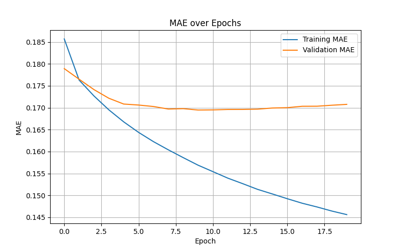
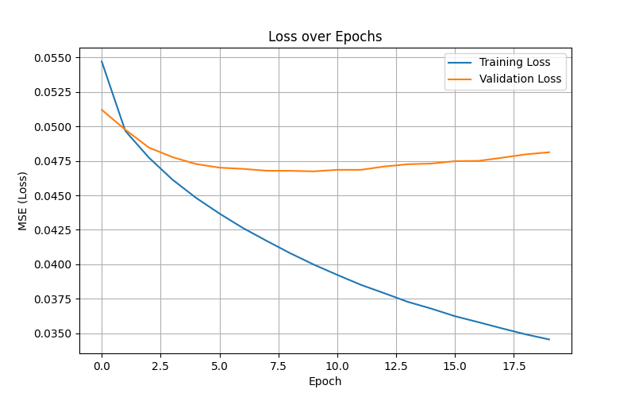
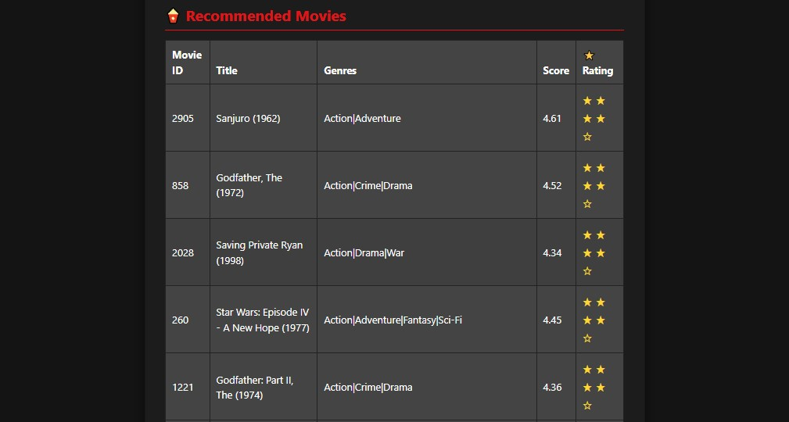

# 🎬 Movie Recommender System - Netflix Style (Hybrid Model)

> A personalized movie recommendation web app built with **Flask**, **TensorFlow**, and a **hybrid recommender model** that combines Collaborative Filtering and Content-Based Filtering.

---

## 📌 Project Overview

This system:
- Predicts user ratings for unseen movies.
- Allows genre-based filtering.
- Displays recommendations in a Netflix-style interface with star ratings and prediction scores.

Technologies used:
- Python 3
- Flask (with Jinja2 templates)
- TensorFlow / Keras
- Pandas, NumPy
- Bootstrap 5.3.3 for frontend styling

---

## 📂 Project Structure

```
Movie-Recommender-System/
├── assets/                     # Images for documentation (UI, graphs, etc.)
├── mae_plot.png                # MAE curve
├── loss_plot.png               # Loss curve
├── form_ui.jpeg
├── recommendations_ui.jpeg

├── app.py                      # Flask backend

├── model/  
├── hybrid_recommender_model.h5# Trained model
├── encodings.pkl              # Encoded user/movie/genre dictionaries

├── ml-1m/
│   ├── movies.dat
│   ├── ratings.dat
│   └── users.dat

├── templates/
│   └── index.html              # UI template

└── README.md
```

---

## 🚀 How to Run the App

1. **Install dependencies**:
   ```bash
   pip install flask tensorflow pandas numpy scikit-learn matplotlib
   ```

2. **Start the Flask app**:
   ```bash
   python app.py
   ```

3. **Open in your browser**:
   ```
   http://127.0.0.1:5000/
   ```

---

## 🧠 Model Architecture

A hybrid deep learning model:

- **Collaborative Filtering**:
  - Learns embeddings for users and movies.
- **Content-Based Filtering**:
  - Uses multi-hot encoded genres.

### Inputs:
- Encoded User ID
- Encoded Movie ID
- Genre vector

### Output:
- Predicted normalized rating (scaled to 0–5 stars)

---

## 📊 Training Results

- ✅ **Final Training MAE:** `0.1456`
- ✅ **Final Validation MAE:** `0.1708`

- 🔁 **Epochs:** 20  
- 🧩 **Embedding size:** 50  
- 🎞️ **Genres:** One-hot encoded with MultiLabelBinarizer

---

## 📈 Training Curves

### MAE over Epochs


### Loss over Epochs


---

## 🖼️ User Interface Preview

### 🎥 Input Form


### 🍿 Recommendation Table


> Modern Netflix-style layout with genre selection, star-based ratings, and responsive design.

---

## 📐 Evaluation

**Metrics:**
- Precision@10
- Recall@10

**Sample of 100 random users:**
```text
📊 Precision@10: 0.7142
📊 Recall@10:    0.6218
```

> Based on comparing recommended movies with actual high-rated movies (rating ≥ 4.0).

---

## 💡 Future Improvements

- [x] Multi-genre selection support
- [x] Genre autocomplete
- [ ] Add movie posters (via TMDB API)
- [ ] Save recommendations by session
- [ ] Pagination for large result sets
- [ ] Add user login/authentication

---

## 👤 Author

**HoussemBouagal**  
📧 Email: mouhamedhoussem813@gmail.com 

🔗 LinkedIn: [[LinkedIn]](https://www.linkedin.com/in/houssem-eddine-bouagal-98025a297)  

🌐 Portfolio:[[Portfolio]](https://houssembouagal.github.io/Portfolio/)
  

---

## 📄 License

This project is provided for learning and demonstration purposes. Contact the author for commercial use or extended rights.